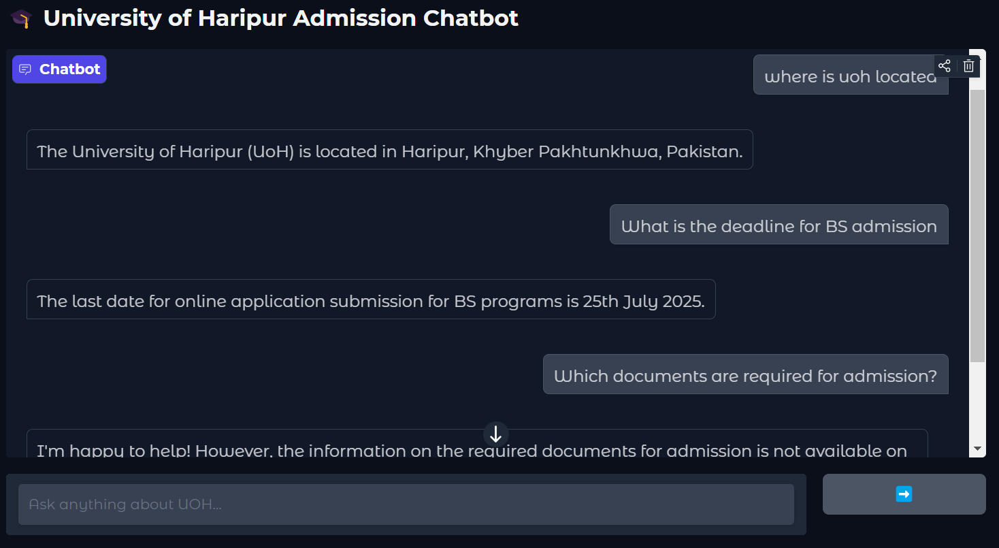

# 🎓 UOH Admission Chatbot

An intelligent, AI-powered chatbot built to help students navigate the admission process at the **University of Haripur (UoH)** — providing up-to-date information on BS, MS, and PhD programs, eligibility, schedules, and more.

---

## 🌟 Features

- 📚 Step-by-step admission guidance for **BS**, **MS**, and **PhD**
- 📅 Live scraping of UoH website for:
  - Admission schedule
  - Entry test details
  - Program eligibility
  - List of BS programs
- 💬 LLM-based chatbot using **Groq API**
- 🎛️ Simple and interactive UI with **Gradio**
- 🧠 Friendly, beginner-focused explanations
- 🔐 API key secured via `.env` (not exposed publicly)

---

## 🖼️ Screenshot



---

## 🌐 Live Demo

👉 Try the chatbot here:  
**[UOH Admission Chatbot on Hugging Face Spaces](https://huggingface.co/spaces/ahmadayaz2022/UOH_Admission_Chatbot)**

---

## 🛠️ Tech Stack

| Tool/Library     | Purpose                      |
|------------------|-------------------------------|
| `Python`         | Core programming language     |
| `Gradio`         | Chatbot user interface        |
| `Groq API`       | Large Language Model backend  |
| `BeautifulSoup`  | Web scraping UoH data         |
| `Schedule`       | Auto-update university data   |
| `dotenv`         | Secure API key management     |

---

## 🧪 Getting Started

### 1. Clone the Repository

```bash
git clone https://github.com/ahmadayaz2022/UOH-Admission-Chatbot.git
cd UOH-Admission-Chatbot


   🚀 Future Improvements
Add MS & PhD program scraping

Include fee structure, scholarships, hostel data

Add multi-language support (Urdu / Pashto)

Export chat history / support voice input

👤 Author
Ahmad Ayaz
🧑‍💻 Software Engineer | AI/ML | Prompt Engineering | Python
